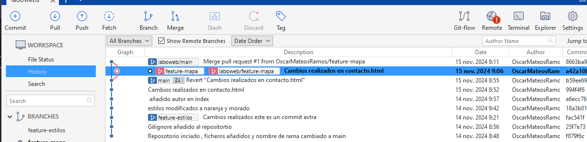

# Tarea LaboWebs

**Autor:** Oscar Mateos Ramos

**URL al repositorio Github:** https://github.com/OscarMateosRamos/labowebs.git

**Nota: Al tener problemas para subir la carpeta docs , he tenido que realizar el repositorio de cero en casa.**

[TOC]

## Trabajo en Local

1-  Inicializa un nuevo repositorio Git en una carpeta llamada **"labowebs"** y agrega los archivos proporcionados en el aula virtual. Renombra la rama master a **main** , si es necesario. Realiza el primer **commit**. Muestra el log del repositorio.


Para añadir los ficheros utilizaremos

```
 git add .
```

 y después haremos un commit de los cambios realizados con 

```
git commit -m
```

Para cambiar el nombre de la rama utilizaremos el comando

```
git branch -m "main"
```


Este es el log del repositorio:


2-Incluye un fichero **.gitignore** para que los ficheros **README.md** , **LICENCE.txt** y **passwords.txt** sean ignorados por el control de versiones. Realiza el commit y muestra los logs del repositorio en una línea.

Creamos el fichero **.gitignore** con el vim


Hacemos **git add .**  , añadimos el fichero al repositorio y hacemos **commit** de los cambios realizados


Esto son los logs del repositorio:

```
git log --oneline
```


3- En el repositorio, crea los archivos **README.md** , **LICENCE.txt** y **passwords.txt** con algún contenido. Muestra el estado del repositorio. Muestra el listado de archivos ignorados.

​	Creamos los ficheros con el vim


Para ver que son ignorados por git utilizamos el comando

```
git status --ignored
```


4- Crea una rama **feature-estilos** . Cámbiate a ella. Modifica el archivo **estilos.css** : propiedad color del **body** y de **h2** : #**2a2a2a** propiedad **background-colo**r de **header** y **footer: #2a75ff***

Creamos una rama con el comando

```
 git branch  feature-estilos
```


Para cambiar de rama usaremos el comando el comando

```
 git checkout feature-estilos
```


modificamos el archivo estilos.css y comprobamos el estado del repositorio

```
git status
```


5- Vuelve a la rama **main** . En el archivo **index.html** añade un comentario donde se indique tu nombre como autor de la página. Comprueba el estado del repositorio. Añade los cambios, realiza un commit con el mensaje ' añadido autor en index'. Muestra los logs del repositorio en una línea, gráficamente y con 'decoración'.

Volvemos a la rama main con el comando

```
git checkout main
```


Mostramos el estado del repositorio antes de realizar los cambios.

```
git status
```


Añadimos los cambios al estagin area con el comando

```
git add .
```


Hacemos commit de los cambios realizados y su comentario

```
git commit -m "añadido autor en index"
```


Estos son los logs del repositorio:

```
git log --oneline --graph
```


6- Fusiona la rama **feature-estilos** en la rama **main** . Muestra los logs del repositorio en una línea, gráficamente y con 'decoración'

Para fusionar la rama **feature-estilos** en la rama main utilizamos el siguiente comando

```
git mergue feature-estilos
```


Mostramos los logs del repositorio en una línea , gráficamente y con decoración

```
git log --oneline --graph
```


## Trabajo en remoto

1- Continúa con el repositorio **labowebs** . Añade el repositorio a **Sourcetree**.

Añadimos el repositorio a Sourcetree


2-Crea un repositorio remoto y sube al remoto los ficheros de tu repositorio local. Debes
subir todas las ramas.


Creamos un nuevo repositorio remoto en Github.


Para subir los ficheros y las ramas desde el repositorio local  con Sourcetree  hacemos click en icono de push.


3- Crea una rama **feature-index** . Añade el siguiente código dentro de la **<section
class="about"> .** Añade los cambios y crea un **commit**. Sube los cambios al remoto


Creamos la rama **feature -index** con **Sourcetree**


Realizamos los cambios necesarios en el fichero **index.html** , hacemos **commit** de los cambios y hacemos un **push** a  nuestro repositorio remoto.


4- En el repositorio local, fusiona la rama  **feature-index** en la rama  **main**. 

Realizamos un Merge


5-Edita el fichero  **contacto.html.** Borra unas líneas. Muestra los ficheros con cambios  pendientes y las diferencias. Añade los cambios y haz un commit.

Una vez editado el contacto.html  nos aparecerá en el stagin area haremos commit de sus cambios y haremos un push a nuestro repositorio remoto


Estas son las diferencias con respecto a la versión anterior


6- Te das cuenta del error. Deshaz el commit anterior. Captura el estado actual del  repositorio


Deshacemos el commit anterior haciendo clik derecho sobre el commit que queremos borrar y después haremos un push a nuestro repositorio remoto para subir los cambios realizados


7-Crea una rama  **feature-mapa** . Incluye este código en el archivo  **contacto.html.** Añade  los cambios. Realiza un commit. Sube los cambios al remoto. Muestra en el remoto los  cambios del archivo  contacto.html en la rama  **feature-mapa.**


Creamos la rama feature - mapa


Editamos el fichero contacto.html, estos son los cambios realizados con respecto a la versión anterior


Estos son los cambios del remoto en archivo contatco.html en la rama **feature-mapa**


8- En GitHub,  en la rama  **main,** fusiona la rama  **feature-mapa**. Baja los cambios del remoto  a local. Deja los dos repositorios sincronizados


En sourcetree haremos un pull y nos tareremos los cambios realizados en github, en nuestro soucetree deberia aparecer esto.




## Conflictos

1-   Crea una rama  **hotfix-js.** Cámbiate a ella. Añade este código en el fichero  **script.js.**   Confirma el cambio y haz un commit.  (Fíjate en los números de línea...)


Creamos una rama llamada **hotfix-js** en Sourcetree


Para cambiarnos de rama clicamos en **hotfix-js** en la seccion de branches. Realizamos los cambios necesarios en script.js hacemos commit de los cambios y hacemos un push a nuestro repositorio remoto.


2-  Vuelve a la rama  **main**. En el fichero  **script.js** en las mismas líneas que en la cuestión  anterior, añade el código siguiente. Confirma el cambio y haz un commit.

Para volver a la rama **main** clicamos en main en la sección de branches


Realizamos el mismo proceso que en el apartado 1


3- Fusiona la rama **hotfix-js** en **main** . Debe producirse un conflicto. Resuélvelo. Cuando
termines la resolución del conflicto sube los cambios al remoto - Deja los repositorios
sincronizados -


Se produce este conflicto a la hora de realizar merge


En el fichero **script.js** git nos marca las lineas en las que existe conflicto y seleccionamos una solución.


Seleccionamos como solucion uno de los ficheros


**Nota:** en el github aparece repetida la estructura de las ramas debido a que en casa he realizado el ejercicio de nuevo para realizar capturas.
